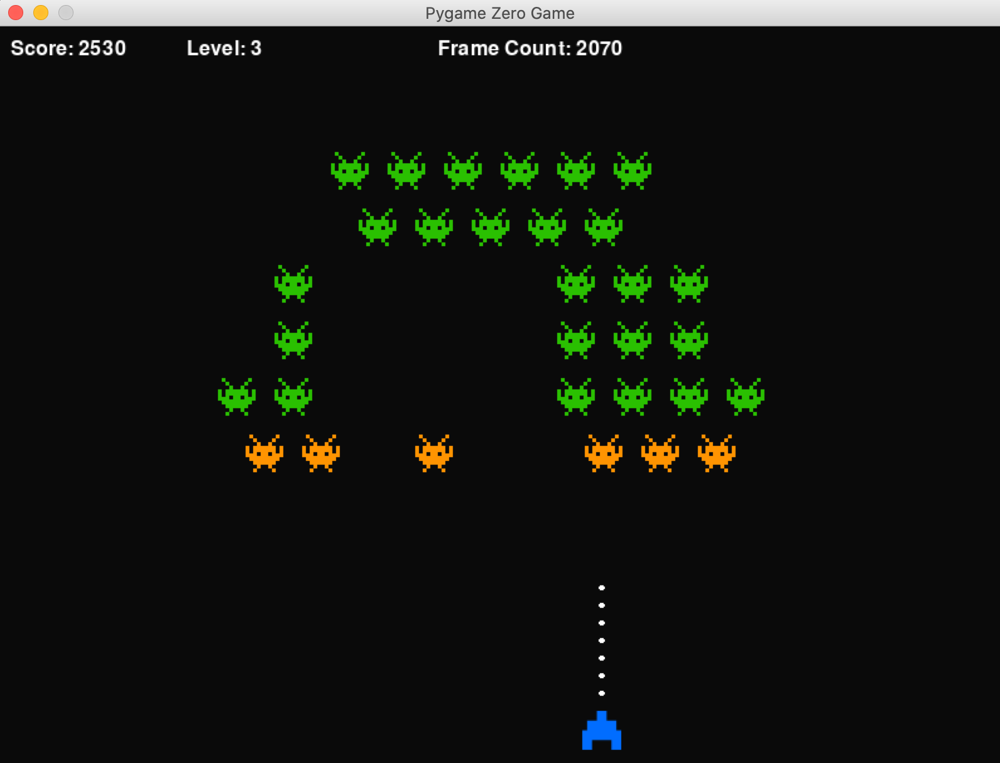

# Pygame Zero Space Invaders 

This is a replica of the classical Space Invaders Game, created using Pygame Zero, with an object oriented programming approach.



**To run the game:**

1. Make sure you have installed Pygame Zero, if not install it by running:

```
pip3 install pgzero
```

2. Run the game with the following command: 

```
pgzrun main.py  
```

**As of now the following functionallity is implemented:**
- Move SpaceShip
- Fire lasers from SpaceShip
- Create weak (low level) Enemies
- Detect laser hits
- Remove enemies with damage level above threshold 
- Add a scoring system 
- Detect game over (when at least one enemy reaches the bottom of the screen)
- "Game Over"-screen 
	- High Score Screen when a `newHighScoreEvent` event is detected
	- Game Over Screen otherwise
- Save highscore (the high score is simply saved in the textfile: `highscore.txt`)
- Add levels system ([read more about level system here](https://github.com/sondreandersen96/space_invaders/blob/master/levelSystem.md))
	- For every 1000 points - move up one level 
- Add multiple types of enemies:
	- Some with higher damage tolerance 
	- Make enemies with harder damage tolerance appear when the game progresses (i.e. higher levels are reached)

**TODO:**
- Add level up graphics
	- A level up message in the info bar at the top displays "LEVEL UP!" for ~2 seconds (use frame count to measure time)
- Update UML diagram
- Maybe add some limiation on how many shots can be fired for some unit of time - so to make the "spray and pray"-tactic less effective
- Enemies shooting back 


## Use this project 
Feel free to clone this reposetory, either to simply play the game or to add more functionallity to it! 


## Note
The UML-diagram has not been updated, and thus just provide an overview of the most basic functionallity of the game. I am planning on updating this diagram soon. 


